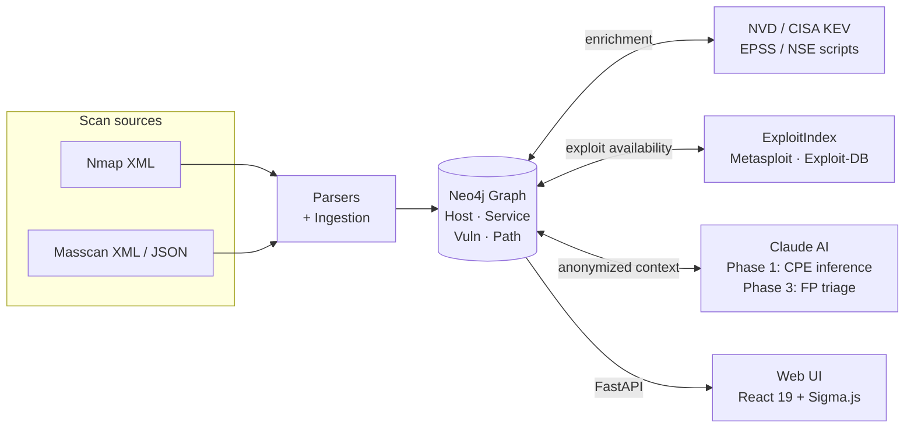

<div align="center">


# Cauldron

**Network Attack Path Discovery — BloodHound for the network layer.**

Throw your scans in. Get attack paths out.

[](LICENSE)
[](https://www.python.org/downloads/)
[](https://github.com/kodych/cauldron/actions/workflows/test.yml)
[](https://github.com/kodych/cauldron/releases)

</div>

---

## What it is

Cauldron turns Nmap and Masscan output into an **interactive attack graph**.
It classifies every host by role, enriches services with CVEs and known
exploits, ranks paths to high-value targets by exploitability, and ships
every finding into a Neo4j-backed UI you can pivot in.

Each new scan from a different network position adds to the same graph —
like throwing more ingredients into a cauldron.

## Why

Every pentester runs the same loop on every engagement:

- Stare at thousands of lines of Nmap XML.
- Mentally classify hosts by their open-port patterns.
- Manually search for CVEs against each service version.
- Keep attack paths in their head, missing non-obvious chains.
- Spend **days** on analysis that should take **minutes**.

Cauldron automates the analytical work so you can spend your engagement
hours on actually exploiting things.

## Features

- **Ingestion** — Nmap XML and Masscan (XML + JSON), with NEW / GONE /
  CHANGED diffing across re-imports from different network positions.
- **Classification** — rule-based role classifier (DC, web, DB, printer,
  hypervisor, SIEM, CI/CD, VPN gateway, backup, …) with AI fallback for
  edge cases.
- **CVE enrichment** — NVD CPE-matched, with EPSS scores and the CISA KEV
  flag end-to-end. CVSS v4.0 → v3.1 → v3.0 → v2 preference chain.
- **Local exploit DB** — ~70 curated rules, ready-to-copy commands per
  finding, default-credentials lookup.
- **AI triage** — Anthropic Claude verifies CVEs against NVD, dismisses
  false positives based on full host context, never auto-dismisses KEVs.
  All host data is anonymized before leaving the box.
- **Attack paths** — direct exploitable paths and pivot paths, ranked by
  score, false-positives excluded by default.
- **Engagement workflow** — owned / target / target-blocked markers,
  per-host and per-service notes, bulk-FP across hosts that share a
  product:port.
- **UI** — React 19 + Sigma.js graph, drag-resizable sidebar, host detail
  with KEV / EPSS / exploit-availability badges.
- **Reports** — full-detail Markdown, JSON, and HTML exports.

See [CHANGELOG.md](CHANGELOG.md) for the full list.

## Quick start

You'll need [Docker](https://www.docker.com/) and an
[Anthropic API key](https://console.anthropic.com/) for the AI features.
Pick one of the two paths.

### Path A: full stack via Docker Compose (recommended for users)

Brings up Neo4j and the Cauldron container together. No Python install needed.

```bash
git clone https://github.com/kodych/cauldron.git
cd cauldron
cp .env.example .env
$EDITOR .env                   # set CAULDRON_ANTHROPIC_API_KEY

docker compose up -d           # neo4j + cauldron
docker compose exec cauldron \
  cauldron brew /app/data/samples/corporate_network.xml
docker compose exec cauldron cauldron boil --nvd --ai
```

Then open http://localhost:8000 — the API serves the web UI from the
same container. Neo4j browser stays at http://localhost:7474.

### Path B: native install (recommended for developers)

Compose starts Neo4j only; `cauldron` runs from your local checkout
with hot reload. Needs Python 3.11+.

```bash
git clone https://github.com/kodych/cauldron.git
cd cauldron
cp .env.example .env
$EDITOR .env

docker compose up -d neo4j     # Neo4j only
pip install -e ".[all]"

cauldron brew data/samples/corporate_network.xml
cauldron taste                 # graph stats
cauldron boil --nvd --ai       # enrich with CVEs + AI triage
cauldron paths                 # top attack paths
cauldron serve                 # API on http://127.0.0.1:8000

# in another terminal — Vite dev server with HMR
cd frontend && npm install && npm run dev
```

The web UI runs at http://localhost:3000 in dev mode.

## CLI reference

| Command | Purpose |
|---|---|
| `cauldron brew <file>` | Import an Nmap or Masscan scan |
| `cauldron brew --source <name> <file>` | Tag the scan with the network position it was run from |
| `cauldron boil [--nvd] [--ai]` | Enrich with CVEs (NVD) and AI triage |
| `cauldron taste` | Graph statistics |
| `cauldron paths` | Top attack paths with exploit detail |
| `cauldron condiments` | Per-host quick reference of guaranteed exploits |
| `cauldron collect` | Extract host lists for downstream tools (Hydra, etc.) |
| `cauldron serve` | Start the REST API for the web UI |
| `cauldron pour --format md\|json\|html` | Export an engagement report |
| `cauldron reset` | Wipe the graph |

Run any command with `--help` for full options. By default, `serve` binds
to `127.0.0.1` only — pass `-h 0.0.0.0` to expose the API on the local
network (the API ships **without authentication**, so do this only
deliberately).

## Architecture



For deeper detail, see [docs/architecture.md](docs/architecture.md).

## Configuration

All settings are environment variables prefixed with `CAULDRON_`. See
[.env.example](.env.example) for the full list. The most important ones:

| Variable | Default | Purpose |
|---|---|---|
| `CAULDRON_NEO4J_URI` | `bolt://localhost:7687` | Where Neo4j lives |
| `CAULDRON_NEO4J_USER` | `neo4j` | |
| `CAULDRON_NEO4J_PASSWORD` | `cauldron` | **change for production** |
| `CAULDRON_ANTHROPIC_API_KEY` | _empty_ | Required for `boil --ai` |
| `CAULDRON_AI_MODEL` | `claude-sonnet-4-6` | Override to swap models |
| `CAULDRON_NVD_API_KEY` | _empty_ | Optional, lifts NVD rate limit |
| `CAULDRON_SEGMENT_PREFIX_LEN` | `24` | Default subnet width for segmentation |
| `CAULDRON_CORS_ORIGINS` | _local dev_ | Override allowed CORS origins |

## Troubleshooting

- **`Cannot connect to the Docker daemon`** — `sudo systemctl start
  docker`, or check that your user is in the `docker` group (you may
  need to log out / back in even after `newgrp docker`).
- **Port 7474 or 8000 already in use** — another local service is
  holding the port. Either stop it or change the host-side mapping
  in [docker-compose.yml](docker-compose.yml) (e.g. `8001:8000`).
- **Neo4j unhealthy on first start** — the JVM needs ~30 s on cold
  boot. `docker compose ps` should clear it; if not, `docker compose
  logs neo4j` will show the heap / pagecache error.
- **NVD enrichment is slow without a key** — the unauthenticated tier
  is 5 requests / 30 s; a key bumps that to 50 / 30 s. Grab one (free)
  at https://nvd.nist.gov/developers/request-an-api-key and set
  `CAULDRON_NVD_API_KEY` in `.env`.
- **AI phases skipped** — check the `boil` output for
  `CAULDRON_ANTHROPIC_API_KEY not set`. Set it in `.env` (Path A) or
  export it in your shell (Path B), then re-run `cauldron boil --ai`.
- **Bind to LAN, not just localhost** — edit
  [docker-compose.yml](docker-compose.yml) and change `"8000:8000"`
  to `"0.0.0.0:8000:8000"`. Cauldron ships **without authentication**,
  so do this only on a trusted Kali / lab segment.

## Development

```bash
# Install with dev tooling
pip install -e ".[all]"

# Backend
ruff check cauldron/
pytest tests/                  # DB-backed tests skip without Neo4j

# Frontend
cd frontend
npm install
npm run dev                    # vite dev server with HMR
npm run build                  # type-check + production bundle
```

See [docs/contributing.md](docs/contributing.md) for the full setup,
testing, and PR workflow.

## Documentation

- [docs/architecture.md](docs/architecture.md) — system overview, data flow, Neo4j schema
- [docs/cli.md](docs/cli.md) — full CLI reference
- [docs/api.md](docs/api.md) — REST API endpoints (Swagger UI at `/docs`)
- [docs/ai-triage.md](docs/ai-triage.md) — how Claude is used for CVE triage
- [docs/contributing.md](docs/contributing.md) — development and PR process

## Acknowledgements

- [Neo4j](https://neo4j.com/) for the graph database
- [Anthropic Claude](https://www.anthropic.com/) for the AI triage
- [Sigma.js](https://www.sigmajs.org/) for the WebGL graph rendering
- [NVD](https://nvd.nist.gov/), [CISA KEV](https://www.cisa.gov/known-exploited-vulnerabilities-catalog), and [FIRST EPSS](https://www.first.org/epss/) for the public vulnerability feeds
- [Nmap](https://nmap.org/) and [Masscan](https://github.com/robertdavidgraham/masscan) for the scanners we ingest from

## License

[MIT](LICENSE).
